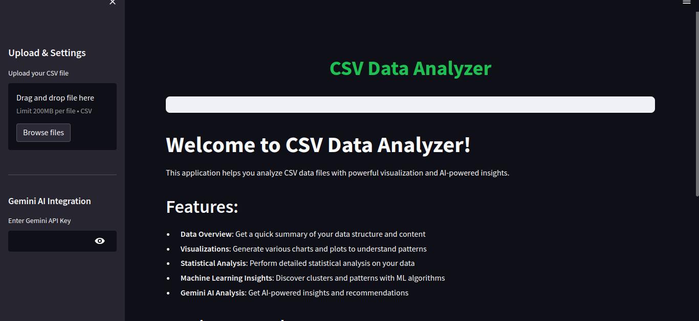

# CSV Data Analyzer

A powerful data analysis application built with Python, Streamlit, and Google's Gemini AI that allows users to upload their own CSV files and get comprehensive analysis results.

## Features

- **Data Overview**: Quick summary of data structure, content, and basic statistics
- **Visualizations**: Interactive charts and plots including histograms, box plots, correlation heatmaps, and scatter plots
- **Statistical Analysis**: Detailed statistical analysis with descriptive statistics and group-by analysis
- **Machine Learning Insights**: Discover patterns with PCA and K-means clustering
- **Gemini AI Analysis**: AI-powered insights and recommendations (requires Gemini API key)

## Requirements

- Python 3.6+
- Streamlit
- Pandas
- Matplotlib
- Seaborn
- Scikit-learn
- Google Generative AI Python SDK

## Installation

```bash
pip install streamlit pandas matplotlib seaborn scikit-learn google-generativeai
```

## Usage

1. Run the application:
```bash
streamlit run app.py
```

2. Upload your CSV file using the sidebar
3. Optionally, add your Gemini API key for AI-powered analysis
4. Explore the different tabs to analyze your data

## Google sign-in setup

This app requires users to sign in with Google before they can access uploaded data or analysis tools.

1. In [Google Cloud Console](https://console.cloud.google.com/), create or select a project and configure the Google Auth Platform OAuth consent screen. For local testing, use the External audience and add the Google accounts that should be allowed as test users.
2. Create an OAuth client ID with application type **Web application**. Add `http://localhost:8501/oauth2callback` as an authorized redirect URI.
3. Copy `.streamlit/secrets.toml.example` to `.streamlit/secrets.toml`.
4. Put your OAuth client ID and client secret in `.streamlit/secrets.toml`. Replace `cookie_secret` with a long random value. Keep this file private; it is excluded by `.gitignore`.
5. Install dependencies and start the app:

   ```powershell
   python -m pip install -r requirements.txt
   streamlit run app.py
   ```

6. Open `http://localhost:8501`, sign in with an allowed Google account, and use **Sign out** in the sidebar to end the app session.

For deployment, register the deployed app's `https://.../oauth2callback` URL with Google and update `redirect_uri` and secrets in the hosting platform's secrets manager. Never commit OAuth credentials.

## Sample Data

A sample dataset (`sample_data.csv`) is included for testing purposes.

[](https://drive.google.com/file/d/1k-lLvTqXvn6jVPf7veY1Jd1Q4DgUGHo1/view?usp=sharing)
